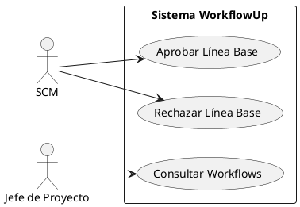
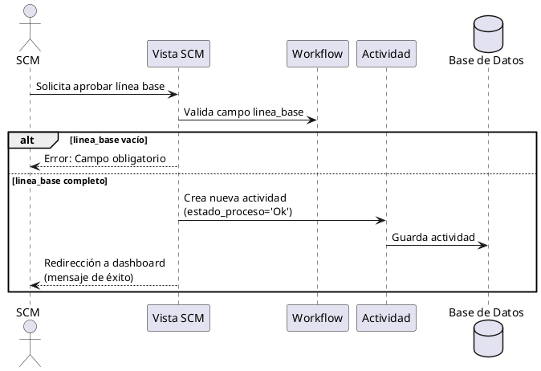
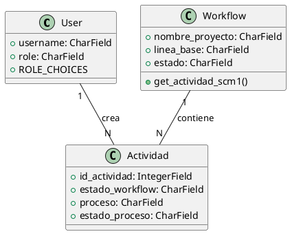

<objective>
Generar diagramas UML completos en formato PlantUML para los roles SCM (Software Configuration Manager), Release Manager (RM) y QA (Quality Assurance) del proyecto Django WorkflowUp.

Crear tres tipos de diagramas por rol:
1. **Diagramas de Casos de Uso**: Mostrando todas las funcionalidades que cada rol puede ejecutar
2. **Diagramas de Secuencia**: Detallando las interacciones entre roles, sistema y modelos para cada operación principal
3. **Diagrama de Clases**: Mostrando las relaciones entre modelos relevantes para cada rol

Estos diagramas servirán como documentación técnica visual del sistema para desarrolladores y arquitectos.
</objective>

<context>
Proyecto: WorkflowUp - Sistema Django 5.2.8 de gestión de workflows con RBAC

Los roles SCM, RM y QA participan en un flujo secuencial de aprobación:
1. **línea base** (SCM) → 2. **RM Rev** (RM) → 3. **Diff Info** (SCM) → 4. **QA** (QA)

Arquitectura relevante:
- Modelo Actividad: Registro inmutable de todas las acciones (audit log)
- Modelo Workflow: Entidad principal con estados y procesos
- Modelo PlanPruebaQA: Plan de pruebas para el rol QA
- Context processors: Navegación basada en roles
- Decoradores: Control de acceso por rol

Leer CLAUDE.md para comprender la arquitectura completa, especialmente "Workflow System Architecture".
</context>

<analysis_requirements>
Antes de generar los diagramas, analiza exhaustivamente:

**Para Diagramas de Casos de Uso:**
- Identifica TODOS los casos de uso de cada rol (aprobaciones, rechazos, consultas, creación de registros)
- Determina actores secundarios (Jefe de Proyecto, otros roles)
- Identifica relaciones <<include>> y <<extend>> entre casos de uso
- Mapea casos de uso a funcionalidades en views.py

**Para Diagramas de Secuencia:**
- Flujos de aprobación (estado "En Proceso" → "Ok")
- Flujos de rechazo (estado "En Proceso" → "No Ok")
- Creación de actividades (incremento de id_actividad)
- Validaciones de campos obligatorios
- Actualización de campos del workflow (linea_base, codigo_rm, etc.)
- Interacciones AJAX (QA: actualización de avance y toggle de rechazo)

**Para Diagrama de Clases:**
- Modelos: User, Workflow, Actividad, PlanPruebaQA
- Relaciones: ForeignKey, OneToMany
- Atributos clave y métodos relevantes (get_actividad_scm1, get_actividad_rm, etc.)
- Estados y choices (ROLE_CHOICES, ESTADO_WORKFLOW_CHOICES, PROCESO_CHOICES, ESTADO_PROCESO_CHOICES)
</analysis_requirements>

<data_sources>
Examina estos archivos para extraer información precisa:
- @CLAUDE.md - Arquitectura y reglas de negocio
- @workflowup/workflow/models.py - Modelos Workflow, Actividad, PlanPruebaQA (métodos helpers en líneas 53-71)
- @workflowup/workflow/views.py - Lógica de vistas por rol
- @workflowup/users_admin/models.py - Modelo User con ROLE_CHOICES
- @workflowup/workflow/templates/workflow/workflow_detail_scm.html - Flujo SCM
- @workflowup/workflow/templates/workflow/workflow_detail_rm.html - Flujo RM
- @workflowup/workflow/templates/workflow/workflow_detail_qa.html - Flujo QA
</data_sources>

<requirements>
Genera los siguientes diagramas en código PlantUML:

**CASOS DE USO (3 diagramas - uno por rol):**
- `casos-uso-scm.puml` - Casos de uso del rol SCM
- `casos-uso-rm.puml` - Casos de uso del rol Release Manager
- `casos-uso-qa.puml` - Casos de uso del rol QA

Cada diagrama debe incluir:
- Actor principal (SCM/RM/QA)
- Actores secundarios (Jefe de Proyecto, Sistema)
- Todos los casos de uso del rol
- Relaciones de inclusión/extensión si aplican
- Agrupación por sistema/subsistema

**SECUENCIA (mínimo 6 diagramas - 2 por rol):**
- `secuencia-scm-aprobar-linea-base.puml`
- `secuencia-scm-rechazar-linea-base.puml`
- `secuencia-scm-aprobar-diff-info.puml`
- `secuencia-rm-aprobar-revision.puml`
- `secuencia-rm-rechazar-revision.puml`
- `secuencia-qa-ejecutar-pruebas.puml`
- `secuencia-qa-aprobar-qa.puml`
- `secuencia-qa-rechazar-qa.puml`

Cada diagrama debe mostrar:
- Participantes: Actor (rol), Vista (view), Modelo Workflow, Modelo Actividad
- Secuencia completa de mensajes
- Validaciones (alt/opt frames)
- Creación de objetos
- Retornos y redirecciones

**CLASES (1 diagrama integrado por cada rol):**
- `clases-scm.puml` - Clases relevantes para SCM
- `clases-rm.puml` - Clases relevantes para RM
- `clases-qa.puml` - Clases relevantes para QA

Cada diagrama debe incluir:
- Modelo User (con ROLE_CHOICES)
- Modelo Workflow (con atributos relevantes al rol)
- Modelo Actividad (con estados y procesos)
- Modelo PlanPruebaQA (solo para diagrama QA)
- Relaciones entre modelos (ForeignKey, herencia)
- Métodos clave (get_actividad_scm1, get_actividad_rm, get_actividad_qa)
- Enumeraciones relevantes (choices)
</requirements>

<plantuml_standards>
Usa estas convenciones PlantUML:

**Para Casos de Uso:**


**Para Secuencia:**


**Para Clases:**


**Estilo general:**
- Usa nombres en español para elementos del dominio
- Incluye notas explicativas para reglas de negocio complejas
- Usa colores para diferenciar estados (ok=verde, no ok=rojo, en proceso=amarillo)
- Agrupa elementos relacionados con packages o rectangles
</plantuml_standards>

<output>
Guarda todos los diagramas PlantUML en: `./documentacion/diagramas/`

Estructura de archivos:
```
./documentacion/diagramas/
├── casos-uso-scm.puml
├── casos-uso-rm.puml
├── casos-uso-qa.puml
├── secuencia-scm-aprobar-linea-base.puml
├── secuencia-scm-rechazar-linea-base.puml
├── secuencia-scm-aprobar-diff-info.puml
├── secuencia-rm-aprobar-revision.puml
├── secuencia-rm-rechazar-revision.puml
├── secuencia-qa-ejecutar-pruebas.puml
├── secuencia-qa-aprobar-qa.puml
├── secuencia-qa-rechazar-qa.puml
├── clases-scm.puml
├── clases-rm.puml
└── clases-qa.puml
```

Cada archivo .puml debe:
- Comenzar con `@startuml`
- Terminar con `@enduml`
- Incluir comentarios explicativos en líneas que comienzan con `'`
- Ser sintácticamente válido (puede ser renderizado por PlantUML)
- Incluir título con `title [Nombre del Diagrama]`
</output>

<verification>
Antes de completar, verifica:

1. ✓ Has analizado todos los archivos de código relevantes (models.py, views.py, templates)
2. ✓ Diagramas de casos de uso incluyen TODOS los casos de uso del rol
3. ✓ Diagramas de secuencia muestran flujos completos (aprobación y rechazo)
4. ✓ Diagramas de clases incluyen todos los modelos relevantes y sus relaciones
5. ✓ Sintaxis PlantUML es correcta (puede ser compilada sin errores)
6. ✓ Nombres en español para elementos del dominio
7. ✓ Reglas de negocio reflejadas en los diagramas (validaciones, campos obligatorios)
8. ✓ 14 archivos .puml generados (3 casos de uso + 8+ secuencia + 3 clases)
9. ✓ Todos los archivos guardados en ./documentacion/diagramas/
10. ✓ Cada diagrama incluye título descriptivo

Verifica específicamente que los diagramas reflejen:
- SCM debe poblar workflow.linea_base antes de aprobar (secuencia-scm-aprobar-linea-base.puml)
- RM debe poblar workflow.codigo_rm antes de aprobar (secuencia-rm-aprobar-revision.puml)
- QA tiene operaciones AJAX para actualizar avance y toggle rechazo
- Comentarios obligatorios en rechazos, opcionales en aprobaciones
- Actividades son inmutables (siempre crear, nunca actualizar)
</verification>

<success_criteria>
- Mínimo 14 diagramas PlantUML generados (3 casos de uso + 8 secuencia + 3 clases)
- Todos los diagramas son sintácticamente válidos
- Diagramas reflejan con precisión la arquitectura del sistema
- Reglas de negocio visualizadas correctamente
- Archivos guardados en ./documentacion/diagramas/
- Diagramas pueden ser renderizados por PlantUML sin errores
- Documentación visual completa para roles SCM, RM y QA
</success_criteria>