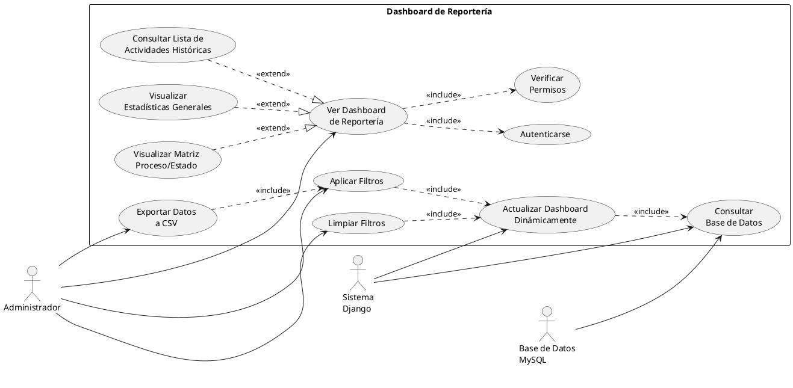
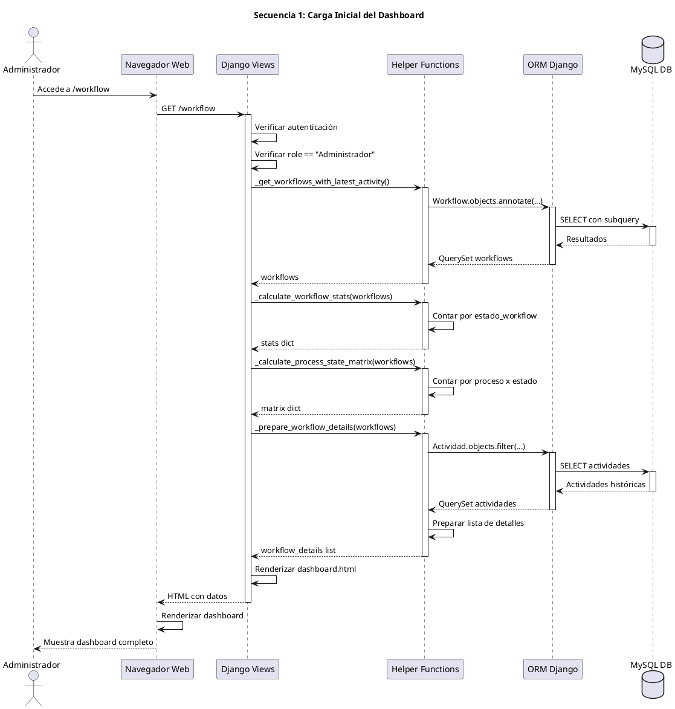
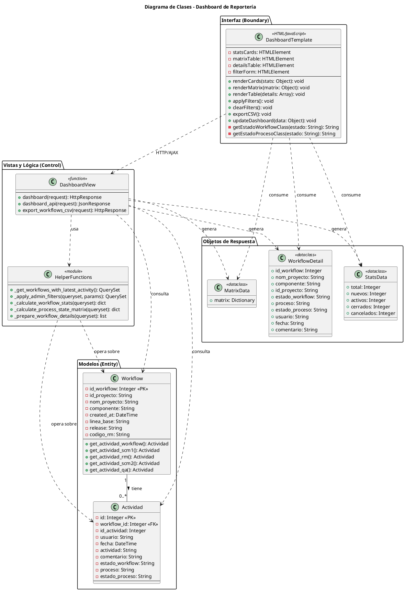

<objective>
Generar diagramas UML completos en formato PlantUML (código de texto) para la funcionalidad de reportería del dashboard de Administrador implementada en WorkflowUp.

Crear tres diagramas profesionales:
1. Diagrama de Casos de Uso
2. Diagramas de Secuencia (3-4 secuencias principales)
3. Diagrama de Clases

Los diagramas deben ser técnicamente precisos, seguir estándares UML 2.5, y reflejar la implementación real del sistema.
</objective>

<context>
Funcionalidad implementada: Dashboard de reportería para Administrador
Ubicación del código:
- Views: `workflowup/workflow/views.py`
- Template: `workflowup/workflow/templates/workflow/dashboard.html`
- URLs: `workflowup/workflow/urls.py`

Actores:
- Administrador (usuario autenticado con role="Administrador")

Componentes principales:
- Vista `dashboard()` - Renderiza página inicial
- Vista `dashboard_api()` - Endpoint AJAX para filtros
- Vista `export_workflows_csv()` - Exportación CSV
- Funciones helper: `_get_workflows_with_latest_activity()`, `_apply_admin_filters()`, `_calculate_workflow_stats()`, `_calculate_process_state_matrix()`, `_prepare_workflow_details()`
- Modelos: `Workflow`, `Actividad`
- Frontend: JavaScript para AJAX y actualización DOM

Casos de uso principales:
1. Ver dashboard de reportería
2. Aplicar filtros dinámicos
3. Limpiar filtros
4. Exportar datos a CSV
</context>

<requirements>

## 1. Diagrama de Casos de Uso

Crear archivo: `./documentacion/diagramas/casos-uso-reporteria.puml`

**Debe incluir:**

### Actores
- **Administrador** (actor principal)
- **Sistema Django** (actor secundario/sistema)
- **Base de Datos MySQL** (actor secundario/sistema)

### Casos de Uso Principales
1. **Ver Dashboard de Reportería**
   - Descripción: Acceder y visualizar el dashboard con estadísticas
   - Actor: Administrador
   - Include: Autenticarse, Verificar Permisos

2. **Visualizar Estadísticas Generales**
   - Descripción: Ver las 5 tarjetas de resumen
   - Actor: Administrador
   - Extend: Ver Dashboard de Reportería

3. **Visualizar Matriz Proceso/Estado**
   - Descripción: Ver matriz de distribución
   - Actor: Administrador
   - Extend: Ver Dashboard de Reportería

4. **Consultar Lista de Actividades Históricas**
   - Descripción: Ver tabla con todas las actividades
   - Actor: Administrador
   - Extend: Ver Dashboard de Reportería

5. **Aplicar Filtros**
   - Descripción: Filtrar datos por criterios múltiples
   - Actor: Administrador
   - Include: Actualizar Dashboard Dinámicamente

6. **Limpiar Filtros**
   - Descripción: Restablecer vista sin filtros
   - Actor: Administrador
   - Include: Actualizar Dashboard Dinámicamente

7. **Exportar Datos a CSV**
   - Descripción: Descargar datos filtrados en formato CSV
   - Actor: Administrador
   - Include: Aplicar Filtros Actuales

8. **Actualizar Dashboard Dinámicamente**
   - Descripción: Actualizar vista vía AJAX sin recargar
   - Actor: Sistema Django
   - Include: Consultar Base de Datos

### Relaciones
- `<<include>>`: Para dependencias obligatorias
- `<<extend>>`: Para funcionalidades opcionales
- Asociaciones entre actores y casos de uso

### Formato PlantUML


## 2. Diagramas de Secuencia

Crear archivo: `./documentacion/diagramas/secuencia-reporteria.puml`

**Debe incluir 4 secuencias:**

### Secuencia 1: Carga Inicial del Dashboard

**Participantes:**
- Administrador (actor)
- Navegador Web (boundary)
- Django Views (control)
- Helper Functions (control)
- ORM Django (control)
- Base de Datos MySQL (entity)

**Flujo:**
1. Administrador accede a `/workflow`
2. Navegador envía GET request
3. Django Views verifica autenticación
4. Django Views verifica role == "Administrador"
5. Views llama `_get_workflows_with_latest_activity()`
6. Helper function consulta DB via ORM
7. DB retorna workflows con última actividad
8. Views llama `_calculate_workflow_stats()`
9. Views llama `_calculate_process_state_matrix()`
10. Views llama `_prepare_workflow_details()`
11. Views renderiza template con datos
12. Navegador muestra dashboard completo

### Secuencia 2: Aplicar Filtros (AJAX)

**Participantes:**
- Administrador
- Navegador Web
- JavaScript
- Django API Endpoint
- Helper Functions
- ORM Django
- Base de Datos MySQL

**Flujo:**
1. Administrador llena formulario de filtros
2. Administrador hace clic en "Aplicar Filtros"
3. JavaScript captura evento
4. JavaScript serializa parámetros de filtro
5. JavaScript envía AJAX GET a `/workflow/dashboard-api/`
6. Django API verifica autenticación y permisos
7. API llama `_get_workflows_with_latest_activity()`
8. API llama `_apply_admin_filters()` con parámetros
9. Helper aplica filtros condicionales
10. ORM ejecuta queries filtradas
11. DB retorna resultados filtrados
12. API llama helpers para calcular stats, matrix, details
13. API retorna JSON con datos
14. JavaScript recibe respuesta
15. JavaScript actualiza DOM (tarjetas, matriz, tabla)
16. Navegador muestra datos actualizados

### Secuencia 3: Exportar a CSV

**Participantes:**
- Administrador
- Navegador Web
- JavaScript
- Django Export View
- Helper Functions
- ORM Django
- Base de Datos MySQL
- Módulo CSV Python

**Flujo:**
1. Administrador hace clic en "Exportar CSV"
2. JavaScript construye URL con parámetros de filtros actuales
3. JavaScript redirige a `/workflow/export-csv/?params`
4. Navegador envía GET request
5. Django Export View verifica autenticación y permisos
6. View llama `_get_workflows_with_latest_activity()`
7. View llama `_apply_admin_filters()` con parámetros
8. ORM ejecuta queries filtradas
9. View obtiene IDs de workflows filtrados
10. View consulta TODAS las actividades de esos workflows
11. DB retorna actividades históricas
12. View crea HttpResponse con content_type='text/csv'
13. View usa csv.writer para escribir headers y filas
14. Django retorna archivo CSV
15. Navegador descarga archivo
16. Usuario guarda archivo localmente

### Secuencia 4: Limpiar Filtros

**Participantes:**
- Administrador
- Navegador Web
- JavaScript
- Django API Endpoint
- Helper Functions
- Base de Datos

**Flujo:**
1. Administrador hace clic en "Limpiar Filtros"
2. JavaScript limpia formulario
3. JavaScript envía AJAX GET a `/workflow/dashboard-api/` sin parámetros
4. Django API procesa sin filtros
5. Retorna datos completos sin filtrar
6. JavaScript actualiza DOM con datos completos

### Formato PlantUML


*Nota: Crear los otros 3 diagramas de secuencia siguiendo el mismo patrón*

## 3. Diagrama de Clases

Crear archivo: `./documentacion/diagramas/clases-reporteria.puml`

**Debe incluir:**

### Clases del Modelo (Entity)
```plantuml
class Workflow {
  - id_workflow: Integer (PK)
  - id_proyecto: String
  - nom_proyecto: String
  - componente: String
  - created_at: DateTime
  - linea_base: String
  - release: String
  - codigo_rm: String
  --
  + get_actividad_workflow(): Actividad
  + get_actividad_scm1(): Actividad
  + get_actividad_rm(): Actividad
  + get_actividad_scm2(): Actividad
  + get_actividad_qa(): Actividad
}

class Actividad {
  - id: Integer (PK)
  - workflow: ForeignKey(Workflow)
  - id_actividad: Integer
  - usuario: String
  - fecha: DateTime
  - actividad: String
  - comentario: String
  - estado_workflow: String
  - proceso: String
  - estado_proceso: String
  --
}

Workflow "1" -- "0..*" Actividad : tiene >
```

### Clases de Vista (Control)
```plantuml
class DashboardView {
  <<function>>
  --
  + dashboard(request): HttpResponse
  + dashboard_api(request): JsonResponse
  + export_workflows_csv(request): HttpResponse
}

class HelperFunctions {
  <<module>>
  --
  + _get_workflows_with_latest_activity(): QuerySet
  + _apply_admin_filters(queryset, params): QuerySet
  + _calculate_workflow_stats(queryset): dict
  + _calculate_process_state_matrix(queryset): dict
  + _prepare_workflow_details(queryset): list
}
```

### Clases de Template (Boundary)
```plantuml
class DashboardTemplate {
  <<HTML/JavaScript>>
  --
  + renderCards(stats): void
  + renderMatrix(matrix): void
  + renderTable(details): void
  + applyFilters(): void
  + clearFilters(): void
  + exportCSV(): void
  + updateDashboard(data): void
}
```

### Relaciones entre Clases
- DashboardView usa HelperFunctions
- DashboardView usa Workflow
- DashboardView usa Actividad
- HelperFunctions usa Workflow
- HelperFunctions usa Actividad
- DashboardTemplate comunica con DashboardView vía HTTP/AJAX

### Formato completo con relaciones


</requirements>

<output>

Crear 3 archivos PlantUML:

1. `./documentacion/diagramas/casos-uso-reporteria.puml`
   - Diagrama de casos de uso completo
   - Incluir todos los actores, casos de uso, y relaciones

2. `./documentacion/diagramas/secuencia-reporteria.puml`
   - 4 diagramas de secuencia en un solo archivo
   - Usar `@startuml` y `@enduml` para cada diagrama
   - Separar con comentarios

3. `./documentacion/diagramas/clases-reporteria.puml`
   - Diagrama de clases completo
   - Organizar en packages (Entity, Control, Boundary)
   - Incluir atributos, métodos, y relaciones

</output>

<plantUML_guidelines>

## Mejores Prácticas PlantUML

1. **Sintaxis clara y comentada**
   ```plantuml
   ' Esto es un comentario
   @startuml
   ' ... contenido ...
   @enduml
   ```

2. **Uso de skinparams para estética**
   ```plantuml
   skinparam packageStyle rectangle
   skinparam classAttributeIconSize 0
   skinparam backgroundColor #FEFEFE
   ```

3. **Colores para distinguir capas**
   - Entity: #LightBlue
   - Control: #LightGreen
   - Boundary: #LightYellow

4. **Estereotipos claros**
   - `<<function>>` para vistas Django
   - `<<module>>` para helpers
   - `<<HTML/JavaScript>>` para templates
   - `<<dataclass>>` para DTOs

5. **Relaciones UML estándar**
   - `--` : Asociación
   - `..>` : Dependencia
   - `--|>` : Herencia
   - `--*` : Composición
   - `--o` : Agregación

6. **Notas explicativas cuando necesario**
   ```plantuml
   note right of Workflow
     Modelo principal que representa
     un flujo de trabajo
   end note
   ```

</plantUML_guidelines>

<validation>

Los diagramas están completos cuando:

1. **Casos de Uso:**
   - [ ] Incluye todos los actores (Administrador, Sistema, BD)
   - [ ] Incluye todos los casos de uso principales (7-8)
   - [ ] Usa relaciones <<include>> y <<extend>> correctamente
   - [ ] Es visualmente claro y organizado

2. **Secuencias:**
   - [ ] 4 secuencias completas (Carga, Filtros, CSV, Limpiar)
   - [ ] Todos los participantes identificados
   - [ ] Flujo completo de mensajes
   - [ ] Activaciones/desactivaciones correctas
   - [ ] Retornos de valores indicados

3. **Clases:**
   - [ ] Incluye modelos Workflow y Actividad con atributos completos
   - [ ] Incluye clases de vista (DashboardView, HelperFunctions)
   - [ ] Incluye clase de template (DashboardTemplate)
   - [ ] Relaciones correctas entre clases
   - [ ] Organizado en packages (Entity, Control, Boundary)
   - [ ] Métodos principales listados

4. **General:**
   - [ ] Sintaxis PlantUML válida (compilable)
   - [ ] Comentarios explicativos donde necesario
   - [ ] Estilo profesional y consistente
   - [ ] Archivos guardados en `./documentacion/diagramas/`

</validation>

<success_criteria>

El trabajo está completo cuando:

1. ✅ 3 archivos .puml creados en `./documentacion/diagramas/`
2. ✅ Diagrama de casos de uso con 7+ casos y relaciones
3. ✅ 4 diagramas de secuencia completos
4. ✅ Diagrama de clases con todas las clases principales
5. ✅ Sintaxis PlantUML válida (compilable en planttext.com o similar)
6. ✅ Diagramas reflejan la implementación real
7. ✅ Siguen estándares UML 2.5
8. ✅ Profesionalmente formateados y comentados

**Verificación:**
Los archivos .puml deben poder compilarse en:
- http://www.plantuml.com/plantuml/
- PlantUML plugin en VSCode/IntelliJ
- Comando `plantuml` en línea de comandos

</success_criteria>
